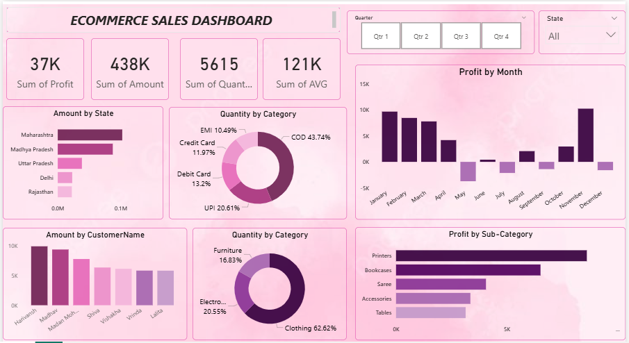

📊 E-Commerce Sales Dashboard 

📌 Overview

This project demonstrates the use of Power BI to analyze and visualize E-Commerce Sales Data.
The dashboard provides interactive insights into profit, sales, quantity, and customer behavior with drill-down capabilities for detailed analysis.

🛠️ Steps Performed

1.Data Cleaning & Transformation

Connected and loaded the dataset into Power BI.

Removed duplicates, handled missing values, and formatted data types.

Created calculated columns and measures using DAX.

2.Data Modeling

Established relationships between tables.

Created hierarchies for drill-down analysis.

3.Dashboard Development

Added KPIs to track Total Profit, Sales Amount, Quantity, and Average Sales.

Used slicers for filtering by Quarter and State.

Designed visuals for state-wise sales, payment mode distribution, customer analysis, category-wise sales, and monthly profit trends.

📚 Project Learnings

Built an interactive dashboard to track and analyze sales performance.

Applied filters, slicers, and drill-downs for dynamic reporting.

Performed data modeling, table joins, and DAX calculations.

Used multiple visualizations including:

🔹KPI Cards

🔹Bar Chart, Pie Chart, Donut Chart

🔹Slicers

📸 Dashboard Preview

✨ Insights

COD is the most preferred payment mode (~43%).

Clothing contributes the highest sales (~62%).

Printers & Bookcases are top sub-categories by profit.

📌 Tools & Technologies

🔹Power BI Desktop

🔹DAX (Data Analysis Expressions)

🔹Data Modeling

🔹GitHub for project sharing

🚀 How to Use

Clone this repository:

git clone  https://github.com/prachi-madane14/POWERBI-ECOMMERCE-SALES-DASHBOARD.git

Download the .pbix file from the report/ folder.

Open it in Power BI Desktop.

Explore the interactive dashboard using filters and slicers.

Profit fluctuates across months, with peaks in January & December.

Maharashtra leads in state-wise sales performance.
